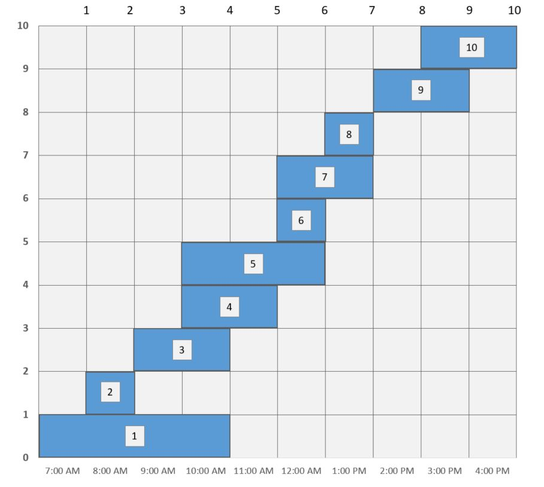

<h2>Efficient Task Scheduler</h2>

<h3>Intro</h3>

Program uses <b>Greedy Algorithm.</b>

Due to wikipedia:

<i>A greedy algorithm is any algorithm that follows the problem-solving heuristic of making the locally optimal choice at each stage with the intent of finding a global optimum. </i>

<h3>Demo</h3>
<ul>
  <li>SLA document requires comapny to process at least 10 tasks per day.</li>
  <li>We have to schedule 10 tasks that lasts x hours (range: 1 - 8 hours) each to process.</li>
  <li>Depending on task x can equals 1, 2 up to 4 hours.</li>
  <li>Tasks comes at different time
  <li>The main goal of task scheduler is to schedule as many tasks as possible to one employee.</li>
  <li>The tasks are compatible with each other when they don't overlap.</li>
  <li>The work system assumes that tasks that left will be shifted to assistant of an employee.</li>
</ul>

